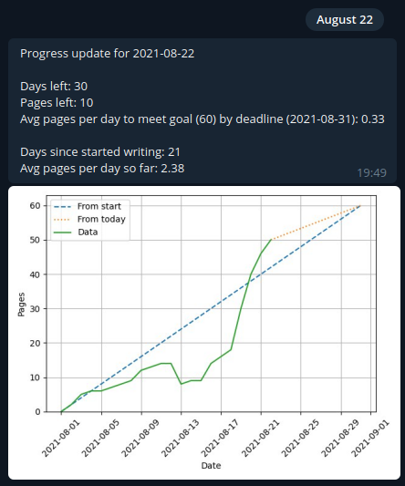

# Telegram Deadline Tracker (Teledeadtrack)

A simple utility for tracking pages (e.g. of a document) towards a goal with a given deadline.

## Usage
1. Set up a Telegram bot (as described [here](https://core.telegram.org/bots#6-botfather)) and make a secure note of the token.
2. Get your personal ID (some methods [here](https://www.alphr.com/find-chat-id-telegram/), I used [@getidsbot](https://t.me/getidsbot)).
3. Initialise a file called `date-page.csv` in the same directory as `deadline_bot.py` with two columns: one containing the date in the format "yyyy-mm-dd" and the other containing the page count for that day. When updating with new dates and page counts, make sure to append to the file. The first line of the file should read `Date,Pages`
4. Run the `deadline_bot.py` script and pass in the following arguments at run time:
    - `--bot-token` : Your bot token string from step 1.
    - `--chat-id` : Your chat id string from step 2.
    - `--deadline-str` : Deadline in the form "yyyy-mm-dd"
    - `--goal-pages` : Goal number of pages as an integer.

The script will then run until exited and send a daily progress message via Telegram.

## Requirements
- Python 3.8 with libraries:
    - Pandas 1.3
    - Matplotlib 3.4
    - Requests 2.26
Other versions of Python 3 and the listed libraries may work but are untested.

## License
[MIT](https://opensource.org/licenses/MIT)
